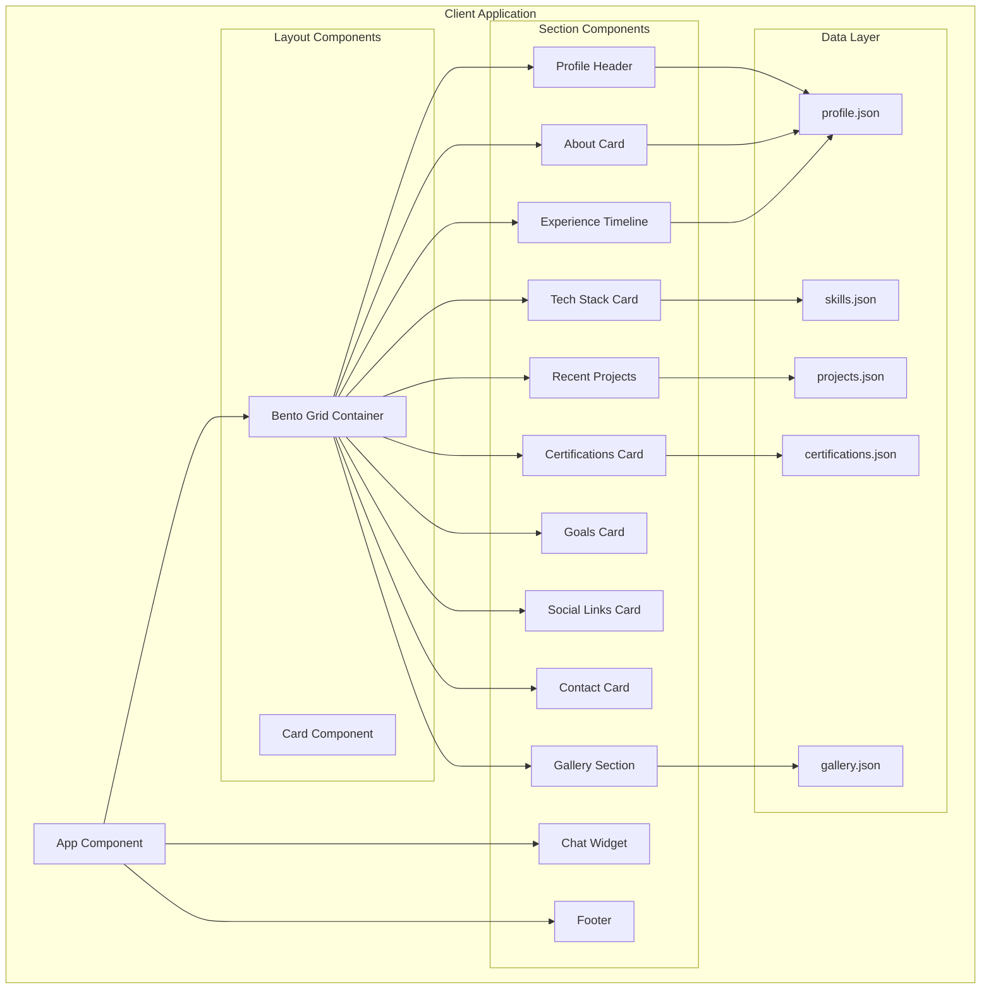

# Design Document

## Overview

This design document outlines the architecture for a modern portfolio website featuring a bento-box card-based layout. The design mimics a clean, minimalist aesthetic with rounded cards arranged in a grid pattern, similar to dashboard interfaces. The portfolio showcases profile information, experience timeline, tech stack, projects, certifications, goals, social links, contact information, and a photo gallery. A floating chat widget provides visitor interaction.

## Architecture

### High-Level Architecture



### Technology Stack

- **Framework**: React 19 with functional components and hooks
- **Build Tool**: Vite (fast development and optimized production builds)
- **Styling**: CSS Modules with CSS custom properties for theming
- **Icons**: React Icons (using Feather, Bootstrap, and custom icons)
- **Testing**: Vitest for unit tests, fast-check for property-based testing
- **Form Handling**: React Hook Form for chat input

## Components and Interfaces

### Component Hierarchy

```
App
├── BentoGrid (main layout container)
│   ├── ProfileHeader
│   │   ├── ProfileImage
│   │   ├── NameBadge (name + verification icon)
│   │   ├── Location
│   │   ├── Title
│   │   └── ActionButtons (View Resume, Send Email)
│   ├── AboutCard
│   │   ├── CardHeader (icon + title)
│   │   └── BiographyText
│   ├── ExperienceCard
│   │   ├── CardHeader
│   │   └── Timeline
│   │       └── TimelineEntry[] (marker, title, description, year)
│   ├── TechStackCard
│   │   ├── CardHeader
│   │   └── SkillCategory[]
│   │       ├── CategoryTitle
│   │       └── SkillTag[]
│   ├── ProjectsCard
│   │   ├── CardHeader
│   │   └── ProjectGrid
│   │       └── ProjectItem[] (name, description, link)
│   ├── CertificationsCard
│   │   ├── CardHeader
│   │   └── CertificationList
│   │       └── CertificationItem[] (name, issuer)
│   ├── GoalsCard
│   │   ├── CardHeader
│   │   └── GoalStatement[]
│   ├── SocialLinksCard
│   │   ├── CardHeader
│   │   └── SocialButton[] (icon, platform name)
│   ├── ContactCard
│   │   ├── CardHeader
│   │   ├── AvailabilityText
│   │   ├── CTALink
│   │   └── ContactButtons (Email, Phone, Messenger)
│   └── GallerySection
│       ├── SectionHeader
│       └── GalleryGrid
│           └── GalleryImage[]
├── ChatWidget
│   ├── ChatButton (floating)
│   ├── ChatWindow (expandable)
│   │   ├── ChatHeader (avatar, name, status)
│   │   ├── MessageList
│   │   │   └── Message[] (content, timestamp, sender)
│   │   └── ChatInput
└── Footer
    └── Copyright
```

### Key Component Interfaces

```typescript
// Profile data structure
interface Profile {
  name: string;
  verified: boolean;
  location: string;
  title: string;
  avatar: string;
  resumeUrl: string;
  email: string;
  phone: string;
  messengerUrl: string;
  bio: string[];
  experience: ExperienceEntry[];
  goals: string[];
}

interface ExperienceEntry {
  id: string;
  title: string;
  description: string;
  year: number;
  isCurrent: boolean;
}

// Tech Stack structure
interface TechStackData {
  categories: SkillCategory[];
}

interface SkillCategory {
  id: string;
  name: string;
  skills: string[];
}

// Projects structure
interface Project {
  id: string;
  name: string;
  description: string;
  url: string;
}

// Certifications structure
interface Certification {
  id: string;
  name: string;
  issuer: string;
}

// Gallery structure
interface GalleryImage {
  id: string;
  src: string;
  alt: string;
}

// Social Links
interface SocialLink {
  platform: 'linkedin' | 'github' | 'instagram';
  url: string;
  icon: string;
}

// Chat types
interface ChatMessage {
  id: string;
  content: string;
  sender: 'user' | 'owner';
  timestamp: Date;
}

interface ChatState {
  isOpen: boolean;
  messages: ChatMessage[];
}
```

## Data Models

### JSON Data Files Structure

#### profile.json
```json
{
  "name": "Developer Name",
  "verified": true,
  "location": "City, Country",
  "title": "BSIT Student / Aspiring Web Developer",
  "avatar": "/images/avatar.jpg",
  "resumeUrl": "/resume.pdf",
  "email": "email@example.com",
  "phone": "123-456-7890",
  "messengerUrl": "https://m.me/username",
  "bio": [
    "First paragraph of biography...",
    "Second paragraph of biography..."
  ],
  "experience": [
    {
      "id": "exp-1",
      "title": "BS Information Technology - 4th Year",
      "description": "University Name",
      "year": 2025,
      "isCurrent": true
    }
  ],
  "goals": [
    "Grow and build a strong career in IT through continuous learning and hands-on experience.",
    "Improve my skills in software development and contribute to real-world impactful projects."
  ],
  "socialLinks": [
    { "platform": "linkedin", "url": "https://linkedin.com/in/..." },
    { "platform": "github", "url": "https://github.com/..." },
    { "platform": "instagram", "url": "https://instagram.com/..." }
  ]
}
```

#### skills.json
```json
{
  "categories": [
    {
      "id": "frontend",
      "name": "Frontend",
      "skills": ["HTML", "CSS", "JavaScript", "React (Vite)", "React Native", "Flutter", "Tailwind CSS"]
    },
    {
      "id": "backend",
      "name": "Backend",
      "skills": ["Node.js", "Firebase"]
    },
    {
      "id": "tools",
      "name": "Tools & Frameworks",
      "skills": ["GitHub", "VS Code", "Figma", "Firebase Tools"]
    },
    {
      "id": "foundational",
      "name": "Foundational Skills",
      "skills": ["UI Design Basics", "API Integration (Beginner)", "AI Integration (Learning)", "Responsive Web Design", "PHP (Beginner)", "Python (Learning)"]
    }
  ]
}
```

#### projects.json
```json
{
  "projects": [
    {
      "id": "proj-1",
      "name": "Q-RUSH",
      "description": "Barangay Queuing & Appointment System",
      "url": "https://bangkalqrush.com"
    }
  ]
}
```

#### certifications.json
```json
{
  "certifications": [
    {
      "id": "cert-1",
      "name": "IT Specialist - Device Configuration and Management",
      "issuer": "Certiport - A Pearson VUE Business"
    }
  ]
}
```

#### gallery.json
```json
{
  "images": [
    {
      "id": "img-1",
      "src": "/images/gallery/photo1.jpg",
      "alt": "Description of photo"
    }
  ]
}
```

## Bento Grid Layout

### Desktop Layout (>1024px)
```
┌─────────────────────────────────────────────────────────────┐
│                     PROFILE HEADER                          │
│  [Photo] Name ✓  Location  Title  [View Resume] [Send Email]│
└─────────────────────────────────────────────────────────────┘
┌───────────────────────────┐ ┌───────────────────────────────┐
│         ABOUT             │ │         EXPERIENCE            │
│                           │ │  ● Title 1          2025      │
│  Biography paragraphs...  │ │    Description                │
│                           │ │  ○ Title 2          2024      │
│                           │ │    Description                │
└───────────────────────────┘ └───────────────────────────────┘
┌───────────────────────────┐ ┌───────────────────────────────┐
│       TECH STACK          │ │   RECENT PROJECTS             │
│  Frontend                 │ │  ┌─────────┐ ┌─────────┐      │
│  [HTML][CSS][JS][React]   │ │  │Project 1│ │Project 2│      │
│  Backend                  │ │  └─────────┘ └─────────┘      │
│  [Node.js][Firebase]      │ │  ┌─────────┐ ┌─────────┐      │
│  Tools & Frameworks       │ │  │Project 3│ │Project 4│      │
│  [GitHub][VS Code]        │ │  └─────────┘ └─────────┘      │
└───────────────────────────┘ └───────────────────────────────┘
                              ┌───────────────────────────────┐
                              │   RECENT CERTIFICATIONS       │
                              │  • Certification 1            │
                              │  • Certification 2            │
                              └───────────────────────────────┘
┌─────────────┐ ┌─────────────┐ ┌─────────────┐ ┌─────────────┐
│   GOALS     │ │SOCIAL LINKS │ │  CONTACT    │ │  CONTACT    │
│  • Goal 1   │ │ [LinkedIn]  │ │ Seeking OJT │ │  BUTTONS    │
│  • Goal 2   │ │ [GitHub]    │ │ Get in touch│ │ [Email]     │
│             │ │ [Instagram] │ │     →       │ │ [Phone]     │
└─────────────┘ └─────────────┘ └─────────────┘ └─────────────┘
┌─────────────────────────────────────────────────────────────┐
│                        GALLERY                              │
│  [img1] [img2] [img3] [img4] [img5] [img6]                  │
└─────────────────────────────────────────────────────────────┘
┌─────────────────────────────────────────────────────────────┐
│                        FOOTER                               │
└─────────────────────────────────────────────────────────────┘
                                                    [💬 Chat]
```


## Correctness Properties

*A property is a characteristic or behavior that should hold true across all valid executions of a system-essentially, a formal statement about what the system should do. Properties serve as the bridge between human-readable specifications and machine-verifiable correctness guarantees.*

### Property 1: Profile header rendering completeness
*For any* valid profile data containing name, verified status, location, title, and avatar, the ProfileHeader component SHALL render all five elements in the output.
**Validates: Requirements 1.1**

### Property 2: Email button contains correct mailto link
*For any* valid profile with an email address, the "Send Email" button SHALL have an href attribute starting with "mailto:" followed by the email address.
**Validates: Requirements 1.4**

### Property 3: About section renders biography
*For any* valid profile data with bio paragraphs, the About component SHALL render all biography paragraphs in the output.
**Validates: Requirements 2.1**

### Property 4: Experience entries render with complete information
*For any* valid experience entry containing title, description, and year, the Experience component SHALL render all three fields in the output.
**Validates: Requirements 3.1, 3.2**

### Property 5: Experience entries sorted in reverse chronological order
*For any* array of experience entries with different years, the Experience component SHALL render them sorted by year in descending order (most recent first).
**Validates: Requirements 3.3**

### Property 6: Current experience entries show active indicator
*For any* experience entry where isCurrent is true, the rendered output SHALL include a visual indicator distinguishing it from past entries.
**Validates: Requirements 3.4**

### Property 7: Tech stack renders all categories with their skills
*For any* valid skills data with categories, the TechStack component SHALL render every category name and all skills within each category.
**Validates: Requirements 4.1, 4.3**

### Property 8: Project cards display complete information with valid links
*For any* valid project data containing name, description, and url, the ProjectCard component SHALL render all three elements and the link SHALL have target="_blank" attribute.
**Validates: Requirements 5.2, 5.3**

### Property 9: Projects section displays correct count
*For any* projects array, the Projects section SHALL display at most 6 projects, showing all if fewer than 6 exist.
**Validates: Requirements 5.4**

### Property 10: Certification entries render with name and issuer
*For any* valid certification data containing name and issuer, the Certifications component SHALL render both fields in the output.
**Validates: Requirements 6.1, 6.2**

### Property 11: Certifications section displays correct count
*For any* certifications array, the Certifications section SHALL display at most 5 certifications, showing all if fewer than 5 exist.
**Validates: Requirements 6.3**

### Property 12: Goals section displays correct count
*For any* goals array, the Goals section SHALL display between 2 and 3 goals (all if 2-3 exist, first 3 if more).
**Validates: Requirements 7.1**

### Property 13: Social links render with correct attributes
*For any* valid social link data containing platform, url, and icon, the SocialLinks component SHALL render each link with the platform name, icon, correct href, and target="_blank" attribute.
**Validates: Requirements 8.1, 8.2, 8.3**

### Property 14: Contact buttons have correct action protocols
*For any* valid contact data with email, phone, and messenger URL, the Contact component SHALL render buttons with href attributes using "mailto:", "tel:", and "https://" protocols respectively.
**Validates: Requirements 9.3, 9.4**

### Property 15: Gallery displays correct count of images
*For any* gallery images array, the Gallery section SHALL display at most 8 images, showing all if fewer than 8 exist.
**Validates: Requirements 10.1**

### Property 16: Chat widget displays profile info when open
*For any* valid profile data with name and avatar, when the chat widget is open, it SHALL display the developer's name and avatar.
**Validates: Requirements 11.3**

### Property 17: Chat messages appear with timestamps
*For any* message sent through the chat widget, the message SHALL appear in the chat history with a timestamp.
**Validates: Requirements 11.4**

### Property 18: JSON data files conform to schema
*For any* data JSON file (profile, projects, skills, certifications, gallery), the data SHALL parse as valid JSON and conform to the expected TypeScript interface schema.
**Validates: Requirements 14.2**

## Error Handling

### Missing Data Handling
- Show placeholder image for missing avatar
- Display "No projects yet" message if projects array is empty
- Gracefully hide sections if their data is empty or missing
- Use fallback text for missing biography

### Image Loading Errors
- Display placeholder image on load failure
- Apply grayscale filter to placeholder to match gallery aesthetic

### Chat Widget Errors
- Display error message if chat fails to send
- Preserve message in input field on send failure
- Show offline status if connection issues occur

### Loading States
- Show skeleton loaders for cards during initial data fetch
- Display loading spinner on chat message send

## Testing Strategy

### Testing Framework
- **Unit Testing**: Vitest (fast, Vite-native)
- **Property-Based Testing**: fast-check library
- **Component Testing**: React Testing Library

### Unit Testing Approach
Unit tests will cover:
- Component rendering with various props
- User interaction handlers (clicks, hover states)
- Edge cases (empty data, missing fields)
- Chat widget open/close behavior

### Property-Based Testing Approach
Property-based tests will verify universal properties using fast-check:
- Each correctness property from the design will have a corresponding PBT
- Tests will run minimum 100 iterations with random inputs
- Generators will create valid and edge-case data structures
- Each test will be tagged with format: `**Feature: portfolio-website, Property {number}: {property_text}**`

### Test File Organization
```
src/
├── components/
│   ├── ProfileHeader/
│   │   ├── ProfileHeader.tsx
│   │   ├── ProfileHeader.module.css
│   │   └── ProfileHeader.test.tsx
│   ├── About/
│   │   └── About.test.tsx
│   ├── Experience/
│   │   └── Experience.test.tsx
│   ├── TechStack/
│   │   └── TechStack.test.tsx
│   ├── Projects/
│   │   └── Projects.test.tsx
│   ├── Certifications/
│   │   └── Certifications.test.tsx
│   ├── Goals/
│   │   └── Goals.test.tsx
│   ├── SocialLinks/
│   │   └── SocialLinks.test.tsx
│   ├── Contact/
│   │   └── Contact.test.tsx
│   ├── Gallery/
│   │   └── Gallery.test.tsx
│   └── ChatWidget/
│       └── ChatWidget.test.tsx
├── utils/
│   ├── sorting.ts
│   └── sorting.test.ts
└── __tests__/
    └── properties/
        └── portfolio.property.test.ts
```

### Key Test Scenarios

| Component | Unit Tests | Property Tests |
|-----------|------------|----------------|
| ProfileHeader | Renders profile data, button clicks | Properties 1, 2 |
| About | Renders biography paragraphs | Property 3 |
| Experience | Entry rendering, sorting, current indicator | Properties 4, 5, 6 |
| TechStack | Categories and skills rendering | Property 7 |
| Projects | Card rendering, link attributes, count | Properties 8, 9 |
| Certifications | Entry rendering, count | Properties 10, 11 |
| Goals | Goal rendering, count | Property 12 |
| SocialLinks | Link rendering, attributes | Property 13 |
| Contact | Button protocols | Property 14 |
| Gallery | Image count | Property 15 |
| ChatWidget | Open state, messages | Properties 16, 17 |
| Data | JSON schema validation | Property 18 |
